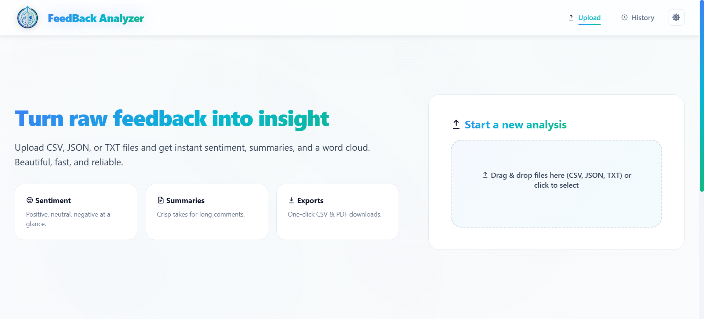
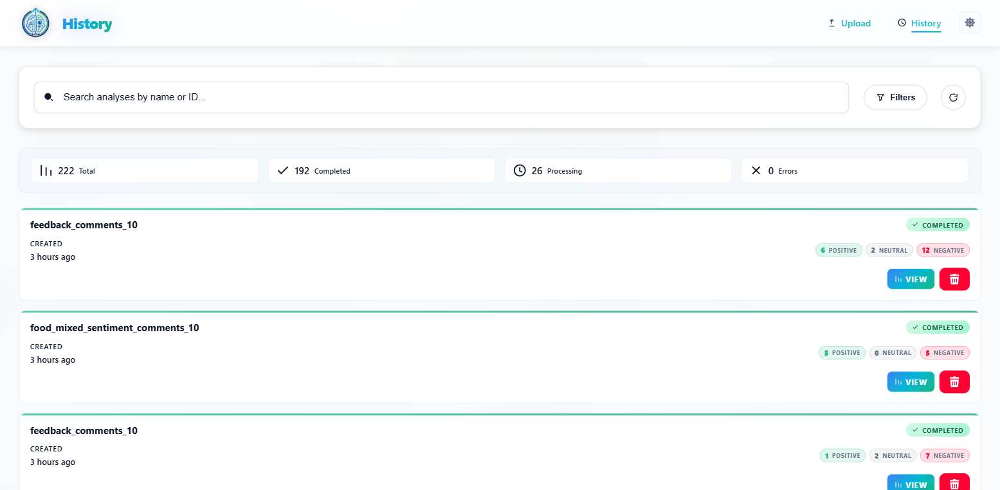
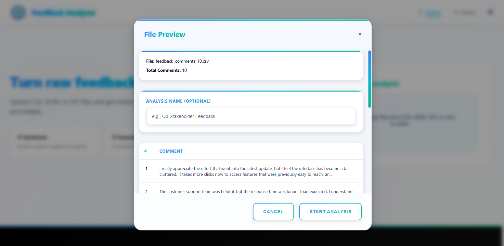
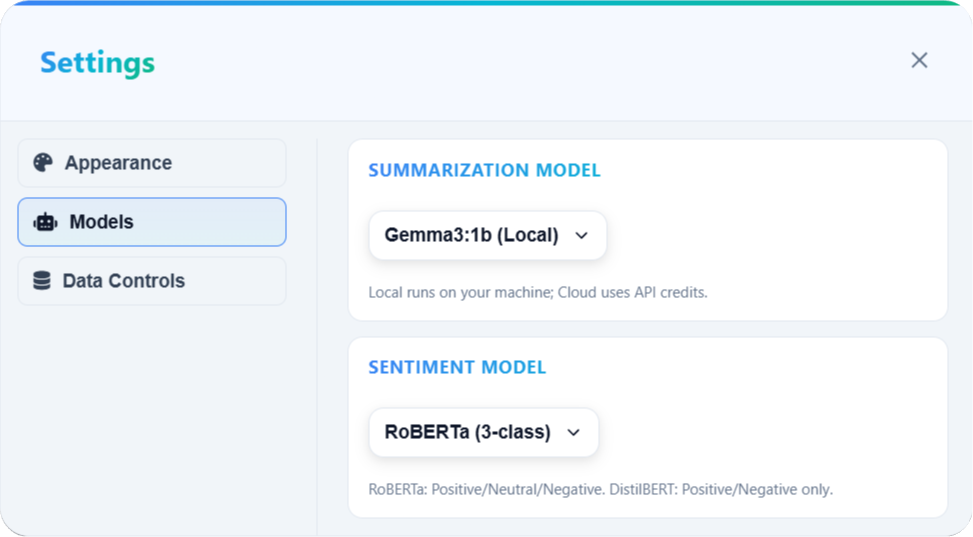
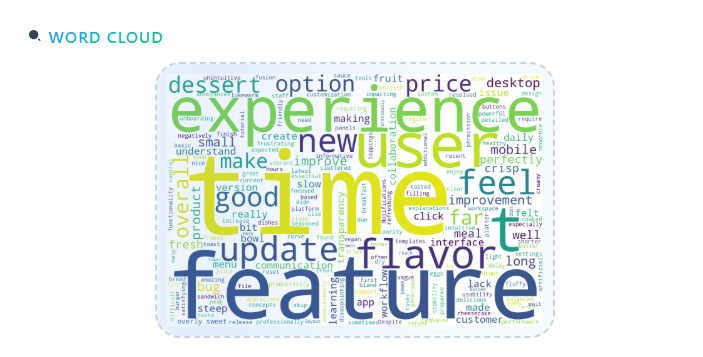
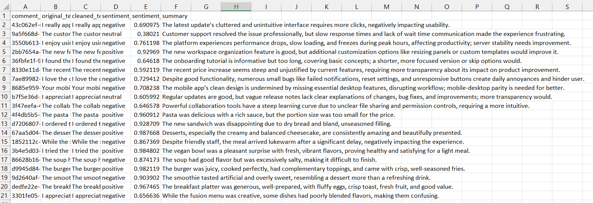

## FeedBack Analyzer

FeedBack Analyzer is an end‑to‑end web application that turns **raw textual feedback** into **actionable insights**.  
It lets you upload feedback files (CSV, JSON, TXT), runs **local transformer‑based sentiment analysis**, generates **AI summaries** (Gemini / Ollama), builds **word clouds**, and exports results as **CSV** and **PDF reports** – all wrapped in a clean, modern UI.

---

## Table of Contents

1. [Key Features](#key-features)
2. [Architecture Overview](#architecture-overview)
3. [Tech Stack](#tech-stack)
4. [Project Structure](#project-structure)
5. [Getting Started](#getting-started)
6. [Configuration](#configuration)
7. [Running the Application](#running-the-application)
8. [Using the Web UI](#using-the-web-ui)
9. [API Overview](#api-overview)
10. [Data & Storage](#data--storage)
11. [Exports & Reporting](#exports--reporting)
12. [Screenshots](#screenshots)
13. [Development Notes](#development-notes)
14. [Troubleshooting](#troubleshooting)
15. [Future Improvements](#future-improvements)
16. [License](#license)

---

## Key Features

- **Multi‑format upload**

  - Upload feedback from `CSV`, `JSON`, or `TXT` files.
  - Supports multiple files per analysis, automatically merged into a single dataset.

- **Transformer‑based sentiment analysis**

  - Uses local Hugging Face transformer models (e.g. RoBERTa / DistilBERT) via `transformers` and `torch`.
  - Produces **per‑comment labels**: `positive`, `neutral`, `negative`.
  - Aggregates counts and scores for dashboards, charts, and exports.

- **AI text summarization**

  - Generates **concise summaries** for long comments.
  - Primary summarizer: **Google Gemini API** via `google-generativeai`.
  - Optional local summarizer: **Ollama** (e.g. `gemma3:1b`) where available.
  - Summarization is **batched and streamed** to keep the UI responsive.

- **Analytics dashboard**

  - Visualizes sentiment distribution (positive/neutral/negative).
  - Displays comment‑level insights, summaries, and key statistics.
  - Generates a **server‑side wordcloud** as a PNG image.

- **History & management**

  - Every upload is stored as an **Analysis** record with metadata and timestamps.
  - View a chronological **history** of analyses.
  - Re‑open, inspect, export, or delete past analyses.

- **Exports: CSV & PDF**

  - **CSV export**: all comments with original text, cleaned text, sentiment, and summary.
  - **PDF export**: multi‑page “Feedback Intelligence Report” with charts, tables, insights, and recommendations using `reportlab`.

- **Modern, responsive frontend**

  - Clean UI built with HTML, CSS, and vanilla JS (`frontend/`).
  - Dark/light theme support via a simple theme toggle persisted in `localStorage`.
  - Loading states, modals, and progress bars for a smooth UX.

- **Admin & diagnostics**
  - Health check endpoint (`/health`) reporting summarizer status and env configuration.
  - Admin endpoints to reload environment variables and dynamically load sentiment models.

---

## Architecture Overview

- **Backend (`backend/`)**

  - FastAPI application (`backend/app.py`) exposes REST endpoints for uploads, analysis, history, exports, and admin.
  - Runs local sentiment analysis using transformer models.
  - Orchestrates AI summarization using Gemini or Ollama in **background tasks** (FastAPI `BackgroundTasks`).
  - Generates server‑side reports (CSV, PDF) and wordclouds.

- **Frontend (`frontend/`)**

  - Static HTML pages (`index.html`, `dashboard.html`, `history.html`) served via FastAPI static mounts or directly from disk in development.
  - Uses `app.js` to call backend APIs for uploads, polling analysis status, rendering charts, and handling exports.
  - `style.css` provides a polished theme with responsive layouts, modals, and status overlays.

- **Data & storage (`data/`)**

  - SQLite database (`data/analyses.db`) stores analyses and comment‑level results.
  - Generated assets such as wordcloud images are stored under `data/wordclouds/`.
  - Exported reports are stored in `data/exports/`.

- **Configuration & logging**
  - Environment variables loaded from a project‑root `.env` file using `python-dotenv`.
  - Centralized log file under `logs/app.log` for backend activity and errors.

---

## Tech Stack

- **Backend**

  - **Framework**: FastAPI
  - **Server**: Uvicorn
  - **Database**: SQLite
  - **ORM / DB access**: Lightweight custom helpers in `backend/db.py`
  - **Environment management**: `python-dotenv`

- **Machine Learning & AI**

  - **Sentiment analysis**: Hugging Face `transformers`, `torch`, `huggingface-hub`
  - **Summarization (cloud)**: `google-generativeai` (Gemini API)
  - **Summarization (local, optional)**: Ollama (e.g. `gemma3:1b`) via custom wrapper
  - **NLP utilities**: `numpy`, `pandas` for data handling

- **Reporting & Visualization**

  - **PDF generation**: `reportlab`
  - **Wordclouds**: `wordcloud`, `Pillow`
  - **Static charts in UI**: Chart.js (loaded on the frontend)

- **Frontend**

  - HTML5, CSS3, Vanilla JavaScript
  - Font Awesome icons, custom SVG icons
  - Responsive layout for desktop and modern browsers

- **Other**
  - File type detection: `filetype`
  - Multipart handling: `python-multipart`
  - HTTP client utilities: `requests`
  - Fast JSON: `orjson`

Dependencies are listed in `requirements.txt`.

---

## Project Structure

Below is a simplified structure of the repository:

```text
FeedBack_Analyzer/
├─ backend/
│  ├─ app.py             # FastAPI app & API routes
│  ├─ db.py              # SQLite connection & helpers
│  ├─ models.py          # Enums (AnalysisStatus, SummaryStatus)
│  ├─ schemas.py         # Pydantic response models
│  ├─ sentiment.py       # Transformer-based sentiment analyzer
│  ├─ summarizer.py      # Gemini & Ollama summarizer implementations
│  ├─ utils.py           # File parsing, text cleaning, helpers
│  └─ __init__.py
│
├─ frontend/
│  ├─ index.html         # Upload & start analysis UI
│  ├─ dashboard.html     # Dashboard view (charts & insights)
│  ├─ history.html       # Analysis history & management
│  └─ static/
│     ├─ css/style.css   # Styles for all frontend pages
│     ├─ js/app.js       # Frontend logic (calls backend APIs)
│     └─ assets/images/  # Logos, icons, chart thumbnails
│
├─ data/
│  ├─ analyses.db        # SQLite database
│  ├─ wordclouds/        # Generated wordcloud PNGs
│  ├─ exports/           # Generated CSV & PDF reports
│  └─ sample_data/       # Example CSVs for testing
│
├─ docs/
│  ├─ documentation/     # Project report, ER diagram, PDFs, etc.
│  │  └─ UI_Screenshots/ # App UI screenshots (used in README)
│  └─ README.md          # Short technical setup notes (internal)
│
├─ logs/
│  └─ app.log            # Application log file
│
├─ requirements.txt
├─ start.bat             # Convenience script to start backend (Windows)
└─ launch.bat            # Optional launcher
```

---

## Getting Started

### Prerequisites

- **Python**: 3.10 or higher (recommended)
- **OS**: Windows 10+ (tested), Linux, or macOS
- **Optional (for local LLM summarization)**:
  - [Ollama](https://ollama.com/) installed and running locally
  - A model such as `gemma3:1b` pulled to your machine

### 1. Clone the repository

```bash
git clone https://github.com/<your-username>/FeedBack_Analyzer.git
cd FeedBack_Analyzer
```

### 2. Create & activate a virtual environment

```bash
python -m venv .venv

# Windows PowerShell
. .venv\Scripts\Activate.ps1

# Windows CMD
.venv\Scripts\activate.bat

# Linux / macOS (bash/zsh)
source .venv/bin/activate
```

### 3. Install dependencies

From the project root:

```bash
pip install -r requirements.txt
```

---

## Configuration

Backend configuration is driven via environment variables, loaded from `.env` in the **project root**.

### 1. Create your `.env` file

Create a file named `.env` in the project root:

```bash
copy .env.example .env  # Windows (if you have an example)
# or manually create .env
```

Then edit `.env` and set at least:

```bash
GEMINI_API_KEY=your_gemini_api_key_here

# Optional overrides
HOST=0.0.0.0
PORT=8000
DATA_DIR=data
LOG_DIR=logs
STATIC_DIR=frontend/static

# Summarization batching controls
MAX_BATCH_CHARS=18000          # Max characters per summarization batch (string length)
MAX_COMMENTS_PER_BATCH=40      # Max comments summarized per batch
```

**Notes**

- If the `.env` file was created on Windows and you see strange behavior with `GEMINI_API_KEY`, the app includes a helper to normalize BOM‑prefixed keys.
- You can always force a re‑read of the `.env` via the `/admin/reload_env` endpoint (see [API Overview](#api-overview)).

---

## Running the Application

You can start the backend either via the provided batch scripts or directly with Uvicorn.

### Option A: Using the provided batch script (Windows)

From the project root:

```bash
start.bat
```

This typically:

- Activates the virtual environment (if configured in the script).
- Starts the FastAPI server using Uvicorn.

### Option B: Manual Uvicorn command

From the project root (with your virtualenv activated):

```bash
uvicorn backend.app:app --host 0.0.0.0 --port 8000 --reload
```

The API will be available at:

- `http://localhost:8000`

If you mount docs or use FastAPI’s built‑in docs:

- Interactive API docs (if enabled): `http://localhost:8000/docs`

---

## Using the Web UI

### Open the UI

In development you have two options:

- **Direct file access**

  - Open `frontend/index.html` in your browser (double‑click or “Open With…”).
  - Ensure all asset URLs (`/static/...`) are reachable. For full functionality, it is recommended to serve via the backend.

- **Via FastAPI static mounts**
  - With the backend running, open:
    - `http://localhost:8000/frontend/index.html` (Upload page)
    - `http://localhost:8000/frontend/history.html` (History)
    - `http://localhost:8000/frontend/dashboard.html` (Dashboard)

### Typical workflow

1. **Start a new analysis (Upload page)**

   - Go to the **Upload** page (`index.html`).
   - Drag & drop one or more files into the dropzone or use the file picker.
   - Supported formats: `.csv`, `.json`, `.txt`.
   - Preview the parsed comments in the **File Preview Modal**.
   - Optionally provide an **Analysis Name**.
   - Click **Start Analysis**.

2. **Processing & status**

   - A status modal/overlay shows upload and sentiment progress.
   - Sentiment is computed locally first; then summarization jobs run in the background.
   - Progress is tracked via `summarization_progress` metadata and displayed in the UI.

3. **View analytics**

   - Navigate to the **Dashboard** (or equivalent view) to see:
     - Sentiment distribution charts.
     - Counts and averages by sentiment.
     - Example comments and summaries.

4. **History & management**

   - Switch to the **History** page (`history.html`) to:
     - See a list of all past analyses (with creation times and status).
     - Open an analysis to inspect comments and summaries.
     - Delete an analysis when no longer needed.

5. **Exports**

   - From the dashboard or history view, use actions such as:
     - **Download CSV** – raw and cleaned comments with sentiment and summary.
     - **Download PDF Report** – “Feedback Intelligence Report” with charts and commentary.

6. **Wordcloud**
   - The UI can request a generated **wordcloud** image per analysis.
   - Backend generates a PNG on demand using the union of all comments & summaries.

---

## API Overview

Below is a high‑level overview of key backend endpoints. For exact request/response schemas, refer to the FastAPI docs (if enabled) or inspect `backend/app.py`.

- **Health & admin**

  - `GET /health`
    - Returns application status, whether Gemini is configured, summarizer status, and the resolved `.env` path.
  - `POST /admin/reload_env`
    - Forces a reload of the `.env` file and re‑initializes the summarizer (if configured).
  - `POST /admin/force_gemini`
    - Attempts to initialize the Gemini summarizer explicitly.
  - `POST /admin/load_sentiment_model`
    - Body parameter: `model_type` (`roberta` or `distilbert`).
    - Dynamically loads the chosen sentiment model into memory.
  - `GET /admin/sentiment_models_status`
    - Returns which sentiment models are currently loaded and which are available.

- **Analysis lifecycle**

  - `POST /analyses/upload`

    - Multipart form with:
      - `files`: list of uploaded files
      - `name` (optional): human‑friendly analysis name
      - `model_type`: summarizer backend (`gemini` or `ollama`)
      - `sentiment_model`: sentiment model variant (`roberta` or `distilbert`)
    - Parses files into comments, runs fast local sentiment, and enqueues summarization in the background.
    - Returns initial `AnalysisOut` plus initial sentiment counts.

  - `GET /analyses`

    - Returns a list of all analyses with metadata (id, name, status, totals, counts).

  - `GET /analyses/{analysis_id}`

    - Query params: `offset`, `limit` for pagination.
    - Returns analysis metadata plus a page of comments (`CommentOut`).

  - `DELETE /analyses/{analysis_id}`
    - Deletes both the analysis record and all associated comments.

- **Summarization control**

  - `POST /analyses/{analysis_id}/summarize`
    - Manually triggers summarization (background task) for the given analysis.
  - `POST /analyses/{analysis_id}/retry-failed-summaries`
    - Resets failed summaries to `pending` and retries them in the background.
    - Also resets progress metadata and clears stale summarizer error messages.

- **Exports & wordcloud**

  - `GET /analyses/{analysis_id}/export.csv`

    - Returns a CSV file (UTF‑8 with BOM) containing:
      - `comment_id`, `original_text`, `cleaned_text`, `sentiment_label`, `sentiment_score`, `summary`.

  - `GET /analyses/{analysis_id}/export.pdf`

    - Generates a multi‑page PDF report:
      - Header with logo and metadata.
      - Sentiment tables, bar chart & pie chart.
      - Optionally a wordcloud figure.
      - Full comment & summary table.

  - `GET /analyses/{analysis_id}/wordcloud`
    - Returns a JSON payload containing a `data:image/png;base64,...` string for the generated wordcloud image.
    - Uses both original text and summaries (when available).

---

## Data & Storage

- **Database**

  - SQLite file: `data/analyses.db`.
  - Stores:
    - Analyses: id, name, timestamps, status, sentiment counts, sentiment model, summary model, meta.
    - Comments: id, original text, cleaned text, sentiment label/score, summary, status, model type, timestamps, and optional `external_file` reference.

- **Generated assets**

  - **Wordclouds**: stored as PNG images under `data/wordclouds/` (as well as returned as base64 via API).
  - **Exports**: PDFs and CSVs under `data/exports/`, following `analysis_<uuid>.pdf` / `.csv` naming.

- **Logging**
  - Main log file: `logs/app.log`.
  - Includes startup info, model loading logs, summarization batch progress, and error traces.

---

## Exports & Reporting

- **CSV Export**

  - One row per comment.
  - Recommended for downstream analysis in Excel, Power BI, or Python notebooks.

- **PDF Report**
  - Generated with `reportlab`.
  - Includes:
    - Title page with metadata and logo.
    - Sentiment overview tables and charts.
    - Top positive / neutral / negative comments (summaries or truncated originals).
    - Insights and recommended next actions.
    - Full comment & summary table for auditability.

---

## Screenshots

For GitHub‑friendly paths and to reuse the assets directly in the app, place your screenshots in the frontend images folder:

- **Source (current)**: `docs/documentation/UI_Screenshots/`
- **Recommended target**: `frontend/static/assets/images/ui/`

Move or copy the screenshot files there (for example: `index.html.png`, `dashboard.html.png`, `history.html.png`, etc.).  
With that structure, you can embed them in this README using the paths below.

- **Upload / Home page**

  ```markdown
  
  ```

- **Dashboard**

  

- **History**

  

- **Preview Modal**

  

- **Settings Modal**

  

- **Wordcloud View**

  

- **CSV & PDF Reports**

  
  

If you prefer, you can replace these fenced examples with direct image embeds in this README so they render as images on GitHub (remove the outer ```markdown fences and keep only the `` lines).

---

## Development Notes

- **Environment handling on Windows**

  - `backend/app.py` includes a helper to normalize environment variable keys in case a BOM (`\ufeff`) prefix appears (common with some Windows editors).
  - This ensures `GEMINI_API_KEY` and other settings are correctly recognized.

- **Model loading strategy**

  - At startup, the app loads the default sentiment model (`roberta`) into memory.
  - Additional models (e.g. `distilbert`) are **lazy‑loaded** via `/admin/load_sentiment_model` when first needed.
  - Summarizer instances (Gemini or Ollama) are created based on `summary_model` selection and environment configuration.

- **Summarization robustness**
  - Summaries are generated **in batches**, and results are **streamed** back to the DB.
  - Each batch’s success rate is checked; if less than 90% of the items succeed, the batch is not persisted (and will be retried).
  - Failed items are marked with `summary_status = error` and can be retried via the retry endpoint.

---

## Troubleshooting

- **The UI shows that Gemini is unavailable**

  - Confirm `GEMINI_API_KEY` is set in `.env`.
  - Check `/health` to ensure `gemini_key_present` is `true`.
  - Use `/admin/reload_env` then `/admin/force_gemini` to reinitialize the summarizer.

- **Summaries are missing or stuck**

  - Check the analysis `meta` in the database for `summarizer_error`.
  - Look at `logs/app.log` for stack traces.
  - Use `POST /analyses/{analysis_id}/retry-failed-summaries` to retry failed items.

- **Models take long to load**

  - Transformer models (`roberta`, `distilbert`) and large LLMs can be heavy.
  - First load may take time; subsequent requests should be faster due to caching in memory and on disk.

- **High memory usage**

  - Reduce `MAX_BATCH_CHARS` and/or `MAX_COMMENTS_PER_BATCH` in `.env`.
  - Consider running with a lighter summarization model (e.g. smaller Gemini or Ollama variant).

- **Static assets not loading**
  - When accessing via the backend, ensure `STATIC_DIR` is correctly set to `frontend/static`.
  - Confirm that `app.mount("/static", StaticFiles(...))` and `app.mount("/frontend", ...)` are active (see `backend/app.py`).

---

## Future Improvements

- **User authentication & multi‑tenant support**

  - Add user accounts and role‑based access control for shared environments.

- **More analytics**

  - Topic clustering, trend analysis over time, and comparison between analyses.

- **More input sources**

  - Direct ingestion from survey tools, CRMs, and ticketing systems (via APIs).

- **Enhanced customization**
  - Customizable sentiment thresholds, summary style (length/temperature), and export templates.

---

## License

This project is currently provided **without an explicit license**.  
Before publishing publicly, you should:

- Choose an appropriate license (e.g. MIT, Apache 2.0, GPL), and
- Add a `LICENSE` file at the project root, and
- Update this section accordingly.


